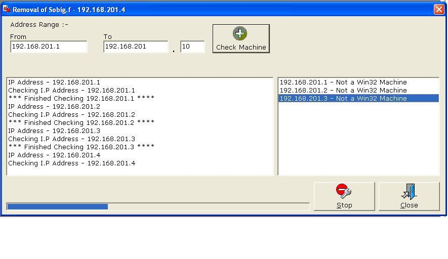



## Sobig Network Remover

### Description

I have designed this code to check a subnet range for the sobig.f virus. If it is found, the virus will be removed from the machine (Please Vote) - Sorry, I found a bug which is now fixed
 
### More Info
 

             |
---                |---
**Submitted On**   |2003-08-20 12:43:22
**By**             |[Santa's Little Helper](https://github.com/Planet-Source-Code/PSCIndex/blob/master/ByAuthor/santa-s-little-helper.md)
**Level**          |Intermediate
**User Rating**    |4.9 (54 globes from 11 users)
**Compatibility**  |VB 6\.0
**Category**       |[Complete Applications](https://github.com/Planet-Source-Code/PSCIndex/blob/master/ByCategory/complete-applications__1-27.md)
**World**          |[Visual Basic](https://github.com/Planet-Source-Code/PSCIndex/blob/master/ByWorld/visual-basic.md)
**Archive File**   |[Sobig\_Netw1633678222003\.zip](https://github.com/Planet-Source-Code/santa-s-little-helper-sobig-network-remover__1-47906/archive/master.zip)

